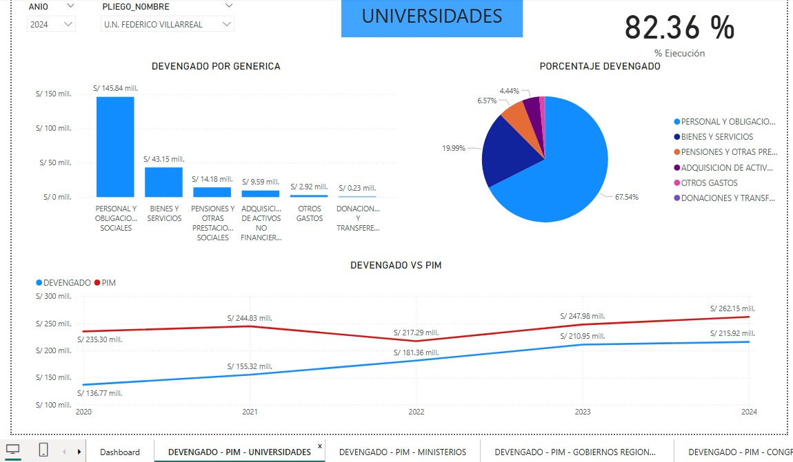
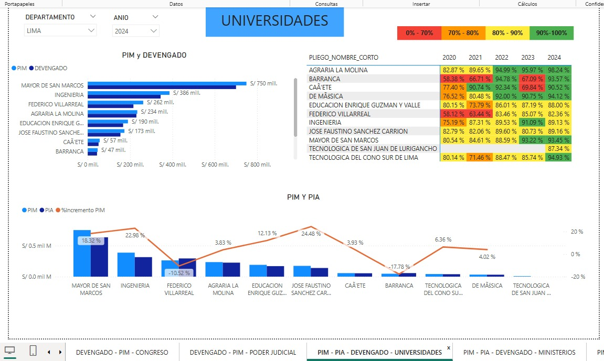

# data-warehouse-sqlserver-etl
Proyecto de Data Warehouse con SQL Server, SSIS y Power BI

OBJETIVO
Este proyecto implementa un Data Warehouse para analizar el presupuesto y la ejecución del gasto público en instituciones del Estado peruano.
Los datos fueron obtenidos de la plataforma de datos abiertos del Perú y abarcan el periodo 2020 - 2025.
Analizar la asignación y ejecución del presupuesto público para identificar tendencias, eficiencia y crecimiento del presupuesto.

ARQUITECTURA
Extracción de datos
Transformación con SSIS
Carga en Data Warehouse (modelo estrella)
Visualización en Power BI

FUENTE DE DATOS
Fuente: Datos abiertos del Perú
Dataset: Presupuesto y ejecución de gasto
Periodo: 2020 - 2025
link: https://www.datosabiertos.gob.pe/dataset/presupuesto-y-ejecuci%C3%B3n-de-gasto

METRICAS
PIA (Presupuesto Institucional de Apertura)
PIM (Presupuesto Institucional Modificado)
Devengado 

CALCULO
Comparación entre PIA - PIM
Comparación enre PIM y Devengado
Porcentaje de crecimiento del PIM

ANALISIS
Comparación entre presupuesto asignado y ejecutado
Análisis por años 
Evaluación por institución 
Tendencias de crecimiento de presupuesto

TECNOLOGIAS
SQL
FINAL_BIGDATA - SSIS PROYECT 
POWER BI - DASHBOARD 

NOTAS
Los datos son publicos 
Proyecto desarrollado para propositos análiticos 
Datos desde el 2020 al 2025

DASBOARDS
link: https://drive.google.com/file/d/18p3xkgnPTmPAxhv8ZLnRcmfOhtRFmDil/view

preview:

